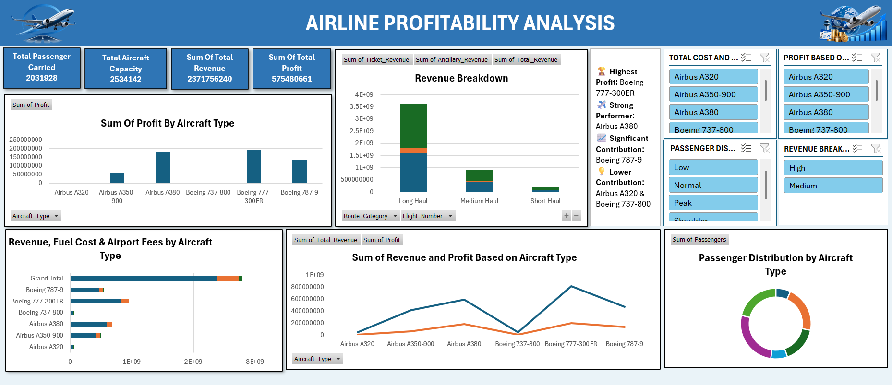

# ✈️ Airline Profitability Analysis

## 📊 Project Overview

The **Airline Profitability Analysis** project is an interactive data analytics dashboard developed using **Microsoft Excel** to evaluate airline financial and operational performance.

The project analyzes key business metrics such as revenue, profit, passenger volume, aircraft capacity, fuel costs, airport fees, and route performance. The dashboard transforms raw airline data into interactive visualizations that can be used to identify performance trends and understand profitability across different aircraft types.

---

## 🎯 Project Objectives

The main objectives of this project are to:

- Analyze profitability across different aircraft types
- Compare total revenue and profit generated by each aircraft
- Analyze passenger distribution and aircraft capacity
- Examine fuel costs and airport fees
- Compare performance across different route categories
- Identify major contributors to airline revenue and profitability
- Build an interactive dashboard for business-oriented analysis
- Present complex data through clear and meaningful visualizations

---

## 📌 Key Performance Indicators

| KPI | Value |
|---|---:|
| Total Passengers Carried | 2,031,928 |
| Total Aircraft Capacity | 2,534,142 |
| Total Revenue | 2.37B |
| Total Profit | 575.48M |

---

## 📈 Dashboard Features

The dashboard provides analysis through multiple interactive visualizations:

### 1. Profit by Aircraft Type
Compares the total profit generated by different Airbus and Boeing aircraft.

### 2. Revenue Breakdown
Analyzes ticket revenue, ancillary revenue, and total revenue across different route categories.

### 3. Revenue, Fuel Cost & Airport Fees
Provides a comparative view of major revenue and operational cost components by aircraft type.

### 4. Revenue & Profit Analysis
Compares revenue and profit generated by individual aircraft types.

### 5. Passenger Distribution
Visualizes the distribution of passengers across different aircraft types.

### 6. Interactive Filters
Allows users to filter and explore the dashboard based on:

- Aircraft Type
- Passenger Distribution
- Revenue Breakdown
- Route Category

---

## 🔍 Key Insights

The analysis provides several business-oriented insights:

- Different aircraft types contribute differently to overall profitability.
- Revenue performance varies across aircraft categories and route types.
- Passenger volume and aircraft capacity provide important operational performance indicators.
- Fuel costs and airport fees represent significant components of airline operating costs.
- Comparing revenue with profit helps identify differences between high-revenue and high-profit aircraft.
- Interactive filtering enables deeper analysis of specific aircraft and route categories.

---

## 🛠️ Tools & Technologies

- **Microsoft Excel**
- Pivot Tables
- Pivot Charts
- Excel Slicers
- Data Analysis
- Data Visualization
- Dashboard Design
- Business Intelligence

---

## 📊 Dashboard Preview



---

## 📂 Project Structure

```text
airline-profitability-analysis/
│
├── Airline_Profitability_Analysis.xlsx
├── Airline_Profitability_Dashboard.png
└── README.md
